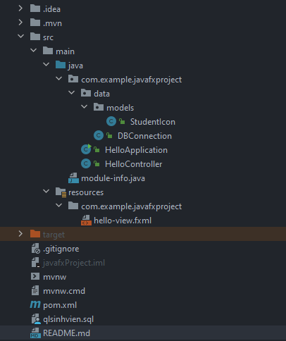
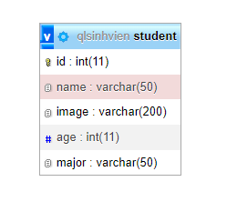

# TRAN VAN LY - JavaFX Project

### Project structure:

### Entity Relationship Model:

### Done features:
- [x] Manage student (Create, Update, Delete, Show)
### Doing features:
- [ ] Login, logout
### Will do-features:
- [ ] Maybe in the near future, I will manage each student's grades.

### Video demo: [Link](https://youtu.be/9OS5PSMiJLY)
